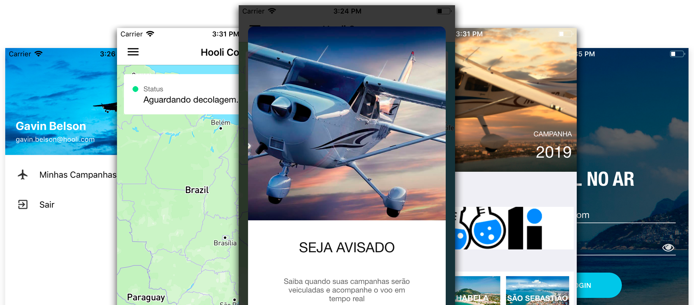

# Visual no Ar

Welcome to the **vis-appsite** repository!

This project is the landing page for the Visual Aerial Advertising product. The site introduces the platform, showcases its features, and provides users with information and links to download the mobile app to track their aerial advertising campaigns in real time.


*VISUAL App landing page preview*

## About VISUAL

VISUAL is a solution for managing and tracking aerial advertising banner towing campaigns. With our mobile app, clients can follow their campaigns live, receive notifications, and access detailed flight information. The landing page serves as the main entry point, engaging users and providing quick access to downloads and information.

## Features

- **Hero Section:** Eye-catching introduction with campaign real-time tracking.
- **Download Links:** Quick access to the mobile app for both iOS and Android.
- **Testimonials:** Showcase of client feedback and success stories.
- **Product Overview:** Highlights of the VISUAL app's capabilities and user benefits.
- **Gallery:** Visual previews of the app experience.


*VISUAL App screenshots and UI previews*

## Getting Started

To set up VIS-APPSITE locally:

1. **Clone the Repository:**
   ```bash
   git clone https://github.com/itseduvieira/vis-appsite.git
   ```
2. **Install Dependencies:**
   ```bash
   cd vis-appsite
   npm install
   ```
3. **Run the Site Locally:**
   ```bash
   npm start
   ```
   - The site will be available at `http://localhost:3000` (or as configured).

## Requirements

- **Node.js** (latest recommended)
- **npm** (latest recommended)
- **Static Asset Hosting** (for production deployment)

## Documentation

- Source code is organized for easy navigation and customization.
- Images, styles, and components are documented inline.
- For further customization, refer to comments in the codebase.

## Contact

For questions or feedback, please open an issue on GitHub or reach out to the repository owner.

---
*This repository is maintained by [itseduvieira](https://github.com/itseduvieira).*
